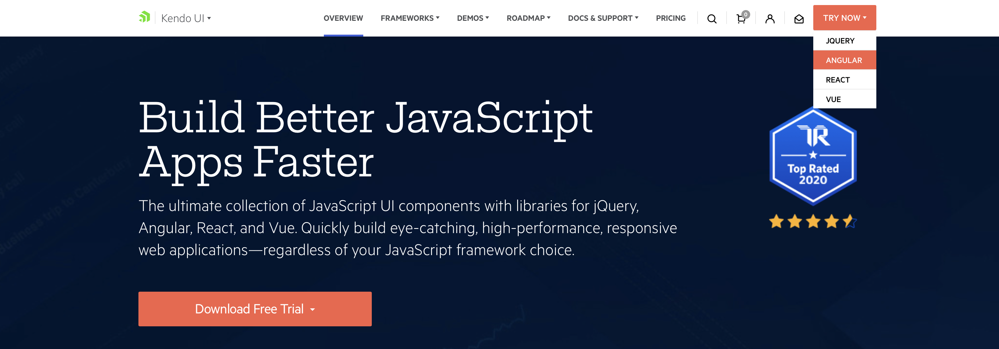
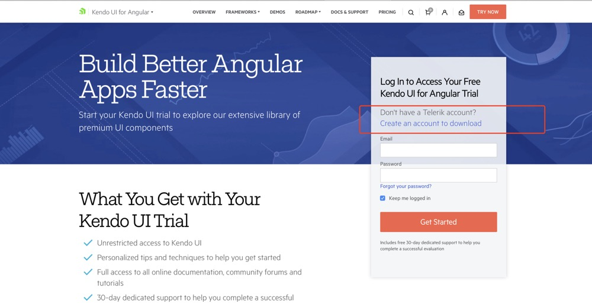

## 教程
#### 关于 Kendo UI 开发教程（w3cschool）（中文）
https://www.w3cschool.cn/kendouidevelopmenttutorial/62s81jv1.html

## 一些博客
#### 集成 Kendo UI for Angular 2 控件
https://www.cnblogs.com/haogj/p/5877829.html

## 下载及引入流程

### 注册

